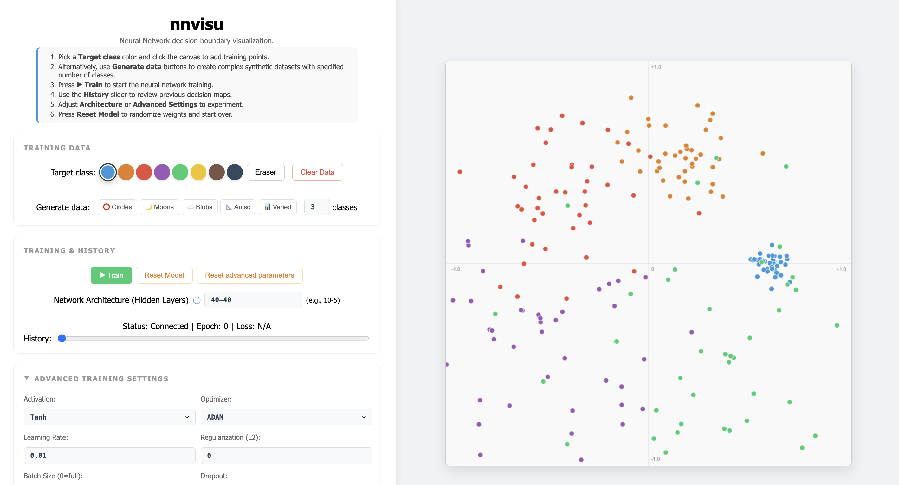

# nnvisu: Neural Network Training Visualizer

A real-time web application to visualize the training process of a neural network on a 2D dataset. Users can interactively define training examples, observe the evolving decision boundaries, and refine the model through incremental training.



## Features

### Interactive Data Definition
- **Manual Entry**: Pick a target class color and click on the canvas to place training examples.
- **Synthetic Generators**: Create complex datasets using built-in generators:
  - ⭕ **Circles**: Concentric circles.
  - 🌙 **Moons**: Interleaving half-circles.
  - ☁️ **Blobs**: Gaussian clusters.
  - 📐 **Aniso**: Anisotropically distributed clusters.
  - 📊 **Varied**: Clusters with varying variances.
- **Multi-class Support**: Configure between 2 and 8 classes for generation.
- **Editing Tools**: Use the Eraser tool to remove specific points or Clear Data to start fresh.

### Real-time Visualization & Analysis
- **Decision Boundaries**: Watch the classification regions change smoothly as the model learns.
- **Training History**: Use the History seekbar to scrub through previous training states and observe how the decision map evolved.
- **Live Metrics**: Monitor training progress with real-time updates for Epoch and Loss.

### Model Configuration
- **Dynamic Architecture**: Define the hidden layer structure (e.g., `10-5-2`) on the fly.
- **Advanced Training Settings**:
  - **Activations**: Tanh, ReLU, Leaky ReLU, GELU.
  - **Optimizers**: ADAM, SGD, RMSProp.
  - **Hyperparameters**: Learning Rate, L2 Regularization, Batch Size, and Dropout.

## How to Use

1. **Pick a Target class** color and click the canvas to add training points.
2. **Alternatively, use Generate data** buttons to create complex synthetic datasets with a specified number of classes.
3. **Press ▶ Train** to start the neural network training.
4. **Use the History slider** to review previous decision maps.
5. **Adjust Architecture or Advanced Settings** to experiment with different model configurations.
6. **Press Reset Model** to randomize weights and start over.

## Tech Stack

- **Backend**: Python 3.11+, Tornado (WebSockets), PyTorch (Inference/Training), NumPy
- **Frontend**: Vanilla JavaScript (ES6), HTML5 Canvas, CSS3
- **Dev Tools**: Pytest, Ruff, Mypy

## Getting Started

### Prerequisites

- Python 3.11+
- Web Browser (Chrome, Firefox, Safari, or Edge)

### Installation

1. Clone the repository:
   ```bash
   git clone https://github.com/honzas83/nnvisu.git
   cd nnvisu
   ```
2. Install dependencies (CPU-only recommended):
   ```bash
   pip install -r requirements.txt
   ```

**Alternative: Install directly from Git**
To install the CPU-only version directly from GitHub without cloning:
```bash
pip install "git+https://github.com/honzas83/nnvisu.git" --extra-index-url https://download.pytorch.org/whl/cpu
```

### Running the Application

1. Start the server:
   ```bash
   python -m nnvisu
   ```
2. Open your browser and navigate to:
   ```
   http://localhost:8888
   ```

## Author

**Jan Švec** (<honzas@kky.zcu.cz>)
Department of Cybernetics, University of West Bohemia.

## License

This project is licensed under the [BSD 3-Clause License](LICENSE).