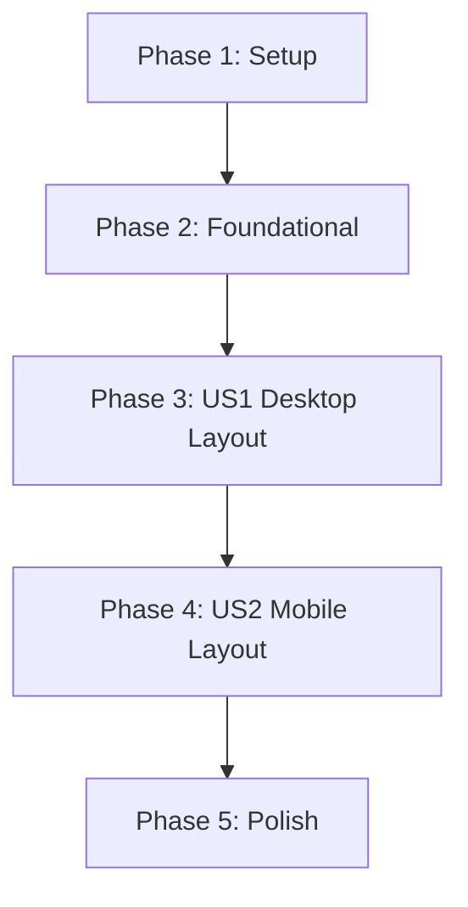

# Tasks: Responsive Layout

**Feature Branch**: `009-responsive-layout`
**Implementation Plan**: [plan.md](plan.md)
**User Stories**:
- US1: Desktop Layout (P1)
- US2: Mobile/Narrow Layout (P2)

## Implementation Strategy

We will follow an incremental approach:
1.  **Metadata & Environment**: Centralize project info and force CPU-only mode.
2.  **Foundational Fixes**: Fix WebSocket proxy resolution and enable metadata sync.
3.  **Desktop Layout (US1)**: Implement the side-by-side grid layout with independent scrolling.
4.  **Mobile Layout (US2)**: Refine the narrow screen experience with proper stacking and scaling.

## Dependency Graph

## Phase 1: Setup (Project Environment)

Goal: Establish centralized metadata and enforce hardware constraints.

- [X] T001 Update `pyproject.toml` with Author "Jan Švec", Version "1.0", and `torch` dependency
- [X] T017 Create `requirements.txt` with CPU-only PyTorch index to avoid CUDA downloads in Docker
- [X] T002 Implement metadata retrieval in `src/nnvisu/__init__.py` using `importlib.metadata`
- [X] T003 [P] Force CPU device usage in `src/nnvisu/logic/model.py`
- [X] T004 [P] Force CPU device usage in `src/nnvisu/logic/trainer.py`

## Phase 2: Foundational (Communication & Infrastructure)

Goal: Fix WebSocket connectivity and enable backend-to-frontend metadata sync.

- [X] T005 Implement dynamic, proxy-aware WebSocket URL resolution in `src/nnvisu/static/main.js`
- [X] T006 Update `src/nnvisu/handlers.py` to send `config` message with metadata upon WebSocket open
- [X] T007 Handle `config` message in `src/nnvisu/static/main.js` to update footer metadata dynamically

## Phase 3: [US1] Desktop Layout (Priority: P1)

Goal: Implement side-by-side layout for wide screens.

**Independent Test**: Resize window to > 1024px. Sidebar should be on the left (400px), canvas on the right. Sidebar scrolls, canvas stays.

- [X] T008 [US1] Group header and controls into a sidebar container in `src/nnvisu/static/index.html`
- [X] T009 [US1] Define desktop CSS Grid layout (sidebar + main) in `src/nnvisu/static/style.css`
- [X] T010 [US1] Implement independent vertical scroll for sidebar in `src/nnvisu/static/style.css`
- [X] T011 [US1] Implement sticky positioning for canvas in `src/nnvisu/static/style.css`

## Phase 4: [US2] Mobile/Narrow Layout (Priority: P2)

Goal: Ensure usability on small screens with proper stacking and scaling.

**Independent Test**: Resize window to < 1024px. Header/Controls stack on top of canvas. Canvas scales to fit width.

- [X] T012 [US2] Restore/Refine vertical stack order for narrow screens in `src/nnvisu/static/style.css`
- [X] T013 [US2] Implement responsive canvas scaling while maintaining aspect ratio in `src/nnvisu/static/style.css`

## Phase 5: Polish & Verification

- [X] T014 [P] Verify smooth layout transitions and no horizontal scrollbars in `src/nnvisu/static/style.css`
- [X] T015 Verify metadata correctly reflects values from `pyproject.toml` in the UI
- [X] T016 Final check of CPU-only enforcement in PyTorch logic

## Parallel Execution Examples

### During Phase 1:
- Agent A: T003 (Model CPU force)
- Agent B: T004 (Trainer CPU force)

### During Phase 3:
- Agent A: T008 (HTML changes)
- Agent B: T009 (CSS Grid setup)
